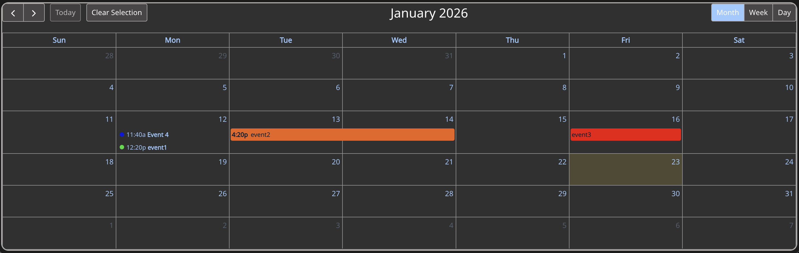

# Calendar Widget

This widget provides a simple interactive calendar to work alongside an ArcGIS Online feature layer. Using the widget is as simple as adding the widget to your application, selecting a data source, and then mapping the fields. This widget is also set up to use message actions, meaning selecting an event on the calendar also selects the feature on any maps, lists, tables, etc. that the data source is also used in. This can also be set to zoom in on a map, apply filtering, and much more. Data filtering also works on the calendar, so if the data source is filtered by another widget, the calendar events will also be filtered.

## Interactive Example

This widget can be used and interacted with on my example application, found [here](https://exb.luciuscreamer.com/calendar). Worth noting, the calendar widget follows Experience Builder styling, to fit the look of your application. If you don't vibe with the dark theme, the widget works just fine in a light themed application.

## Setting up the Calendar

The calendar has a few data formatting requirements if you want all features to work flawlessly OOTB. These will be explained below. These formatting requirements must be fulfilled for all datasources that you want displayed on the calendar, of which you can configure any amount. (Tested working with at least 2)

1. Label Field
   - The label field is what shows up on the event in the calendar (This is a short tagline.)
   - Type: Text
2. Start Date
   - The start date needs to be a Date field, and is required for all events to be populated on the calendar.
   - Type: Date (Date and time)
3. End Date
   - The end date needs to be a date field, but is not required for "all day" events.
   - Type: Date (Date and time)
4. All Day Field
   - The all day field is a simple "y/n" field, to denote whether an event is an "all day" event. The widget only checks if the field is set to "y" to trigger it treating an event as an "all day" event.
   - Type: Text
5. Description Field
   - The description is shown in the tooltip shown when the user hovers over the event. This can be a longer text field, but should likely not be longer than a sentence or two.
   - Type: text
