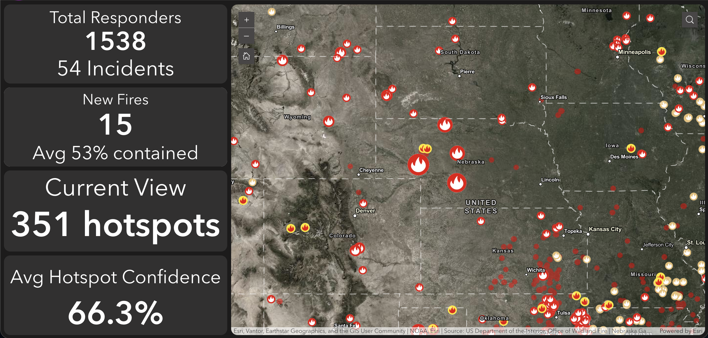

[![npm version][npm-img]][npm-url]

[npm-img]: https://img.shields.io/npm/v/exb-indicator.svg?style=flat
[npm-url]: https://www.npmjs.com/package/exb-indicator

# Indicator Widget

This widget is a simple indicator widget, using the same design principles as the indicator element within ArcGIS Dashboards, allowing users to set up a datasource, and then filter that datasource to display a couple indicator items, with the text filling up the space in the configured box.

## User Experience

The goal of this widget is to show at-a-glance numeric indicators, with reference indicators and easy statistic calculations. This widget brings Experience Builder closer to feature parity with ArcGIS dashboards, allowing an experience to be developed as more of a dashboard look, while retaining all of the customization and widget capability that Experience Builder provides.

## Interactive Example

This widget can be viewed on my example application, found [here](https://exb.luciuscreamer.com/indicator).

## Using this widget

This widget should be used in the just about the same way that the Indicator widget would be used from Dashboards. There are only a couple of exceptions.

1. The entire "General" page from the ArcGIS Dashboards element is gone. Most of the content within the general section pertained to a header element that the user could configure, as well as an info button that would provide some extra information to an end user on the indicator. This is all really useful stuff! However, users will likely want to do a lot of configuration when it comes to the format of the header, info button, etc. Thankfully, Experience Builder has plenty of tools for you to build your own informational UI, so this widget does not provide any of those features. If those are features you still want, use a column widget, text widget, button widget, some windows... go wild.
2. One other thing that is slightly different is the use of the icon. You can no longer upload custom .svg elements, but you are able to upload just about any .png or other graphic elements. I'm not to worried about this tradeoff, but if it becomes a problem, I may look at adding ability to add .svg graphics as well.

Data source configuration can be done by selecting a data source, including custom Arcade Datasources. If you need to configure a data source "real time", use the Arcade data source which can be found within Experience Builder natively.
