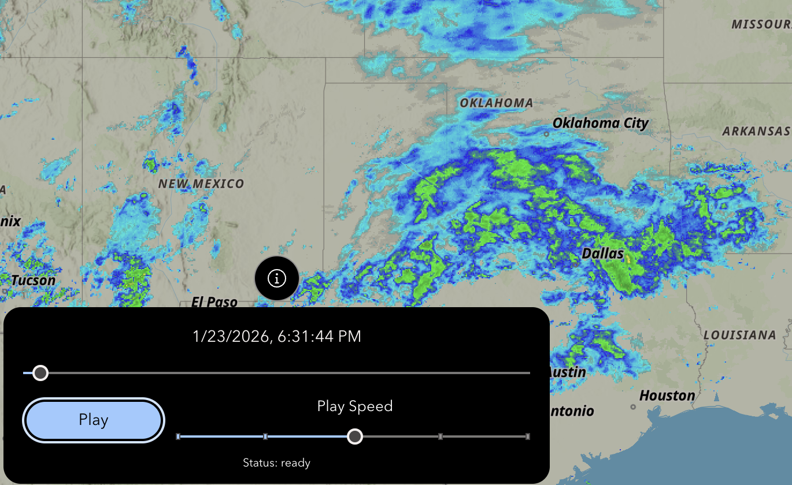

# New Radar Widget

This widget is designed as a replacement for the Rainfall-Radar widget provided by Esri Australia, due to the deprecation of the Rainfall Radar api. This widget uses the NowCoast radar wms layer, but in theory, the same widget could be fairly easily applied to any time enabled wms layer.

## Interactive Example

This widget can be used and interacted with on my example application, found [here](https://exb.luciuscreamer.com/radartest). Worth noting, the new-radar widget follows Experience Builder styling, to fit the look of your application. If you don't vibe with the dark theme, the widget works just fine in a light themed application.

## Using the widget

Using the widget is as simple as adding the widget to an application, and selecting the map that the radar should be displayed in. When the new-radar widget is loaded, a radar wms layer will be added to the top layer of the selected map. Visibility can be controlled by any layer visibility control once the layer has been loaded into the map.

Users can change the time display, swapping between displaying absolute time, and relative time, by clicking the time display button at the top of the widget.

The time slider can be manually manipulated by dragging the time slider left and right.

The speed of playback can be adjusted in 5 different settings using the play speed slider.
