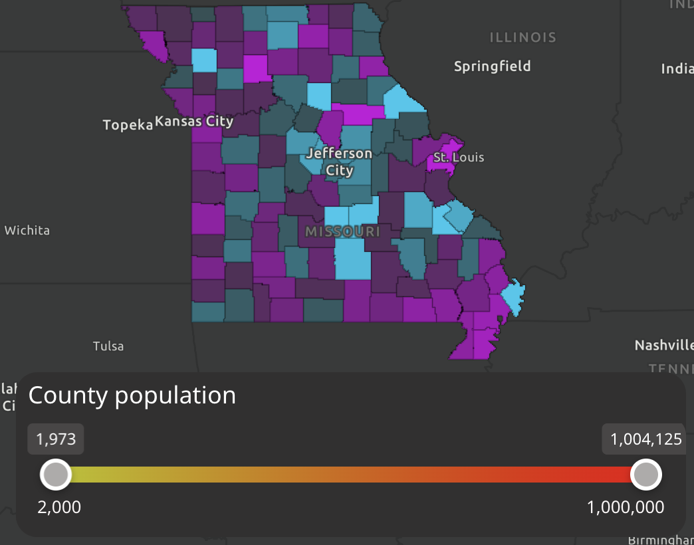

# Slider Filter Widget

This widget is a filter widget, based off of the [idea created by Jose Barrios](https://tinyurl.com/mrsc7a8r). This widget uses a filter that dynamically updates with user input.

## Setting up the widget

Setup is minimal, requiring only a datasource and a field to be selected. The user can also make various stylistic decisions, setting the slider color, defining labels, turning on and off tooltips, and adding tick marks. The filter can be used on both numeric data and on date/time data, and will adapt to either data type without extra user configuration. There are still a few minor kinks in the widget configuration though, which may require a save and page reload to get the changes to appear.

## Interactive Example

This widget can also be viewed within a demo application, filtering county data by total population. The demo application can be found at [https://exb.luciuscreamer.com/slider-filter](https://exb.luciuscreamer.com/slider-filter). Styling is also controlled by the theming settings within experience builder, so it should adapt to whatever theming your application provides.

